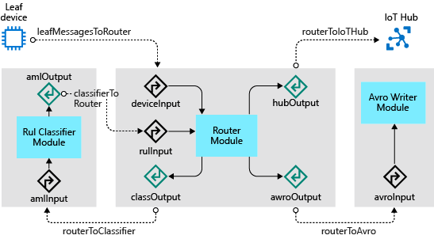

# Continuous Integration / Continuous Development (CI/CD)

- **Static Analysis:** Method of ensuring code quality where code is examined without executing it examples include formatters, linters and vulnerability analyzers (VS Code).  It is important to validate format, remove fluff such as unused variables, potential bugs and also recommend best practices.  
- **Pre-Commit Hooks:** This runs when a git commit is executed.  They are often used to run static analysis, so code is linted and formatted before it is committed.  These commands can be stored in a yaml file or you can run the program flake8 that checks to ensure that your code conforms to the common standards (flake8 --statistics)
- **Unit Tests:** This can be accomplished by creating a new object specific to accomplishing unit tests (Or existing functions) within the object.  This also requires passing ASSERT functions to the objects.  The library pytest runs testing  on files that it finds with test_ in the name.  It is also important to write functions that only accomplish individual tasks that are easily tested to ensure that errors can be easily localized.
    - Your tests should live in a directory at the top level of your project
    - tests are then grouped into modules in the test directory
    - the test directory is usually a mirror image of the source directory.
    - test modules should begin with the name test_ (for readability into the pytest package)
- **Testing in a Staging Environment:** Using multiple different branches (dev/SVT/prod) allows for tests to be run before the final product is pushed out to minimize the impact of any code changes


#### links:
- [Example of CI/CD](https://realpython.com/python-continuous-integration/)
- [Writing good unit tests](https://mitches-got-glitches.medium.com/writing-good-unit-tests-in-python-with-ease-4d8f62227f81)


# Docker Notes:
1. Create a directory for the file and drop your application into the directory.  You also need to create a requirements.txt file that
    will be pushed to the containers.  For Docker, you can use Flask as the application framework and redis as a hit counter
2. Create a Dockerfile.  In your project directory, create a file named Dockerfile and paste the following:

```
# syntax=docker/dockerfile:1
FROM python:3.7-alpine
WORKDIR /code
ENV FLASK_APP=app.py
ENV FLASK_RUN_HOST=0.0.0.0
RUN apk add --no-cache gcc musl-dev linux-headers
COPY requirements.txt requirements.txt
RUN pip install -r requirements.txt
EXPOSE 5000
COPY . .
CMD ["flask", "run"]
```

This tells Docker to:
- Build an image starting with the Python 3.7 image.
- Set the working directory to /code.
- Set environment variables used by the flask command.
- Install gcc and other dependencies
- Copy requirements.txt and install the Python dependencies.
- Add metadata to the image to describe that the container is listening on port 5000
- Copy the current directory in the project to the workdir in the image.
- Set the default command for the container to flask run.

3. Define the services that you need in a compose file (Docker-compose.yml)

```
version: "3.9"
services:
  web:
    build: .
    ports:
      - "8000:5000"
  redis:
    image: "redis:alpine"
```

This Compose file defines two services: web and redis.

- **Web service:** The web service uses an image that’s built from the Dockerfile in the current directory. It then binds the container and the host machine to the exposed port, 8000. This example service uses the default port for the Flask web server, 5000.
- **Redis service:** The redis service uses a public Redis image pulled from the Docker Hub registry.

4. Build and run your app using compose: From your project directory, start up your application by running docker-compose up.

#### links:
- [Getting Started With Docker](https://docs.docker.com/compose/gettingstarted/)
- [More Examples Getting Started with Docker](https://docs.docker.com/get-started/)
- [Explanation of Flask](https://flask.palletsprojects.com/en/2.0.x/)


# Container Orchestration 

**Overview**: Container orchestration is the automatic process of managing or scheduling the work of individual containers for applications based on microservices within multiple clusters. The widely deployed container orchestration platforms are based on open-source versions like Kubernetes, Docker Swarm or the commercial version from Red Hat OpenShift.

**Why is it needed?**
- Configuring and scheduling of containers
- Provisioning and deployments of containers
- Availability of containers
- The configuration of applications in terms of the containers that they run in
- Scaling of containers to equally balance application workloads across infrastructure
- Allocation of resources between containers
- Load balancing, traffic routing and service discovery of containers
 Health monitoring of containers
- Securing the interactions between containers.

**How does this work:** Container orchestration works with tools like Kubernetes and Docker Swarm. Configurations files tell the container orchestration tool how to network between containers and where to store logs. The orchestration tool also schedules deployment of containers into clusters and determines the best host for the container. After a host is decided, the orchestration tool manages the lifecycle of the container based on predetermined specifications. Container orchestration tools work in any environment that runs containers.

**Orchestration tools for Docker include the following:**
- Docker Machine — Provisions hosts and installs Docker Engine.
- Docker Swarm — Clusters multiple Docker hosts under a single host. It can also integrate with any tool that works with a single Docker host.
- Docker Compose — Deploys multi-container applications by creating the required containers.

**Orchestration tools for Kubernetes include the following features:**
- Automated deployment and replication of containers.
- Online scale-in or scale-out of container clusters.
- Load balancing groups of containers.
- Automated rescheduling of failed containers.
- Controlled exposure of network ports to systems outside of the cluster.

#### links:
- [Example for Container Orchestration](https://avinetworks.com/glossary/container-orchestration/#:~:text=The%20Docker%20container%20orchestration%20tool,one%20of%20the%20simplest%20configurations)
- [Getting Started with Orchestration](https://docs.docker.com/get-started/orchestration/)
- [How to Run a Python App in a Container](https://collabnix.com/how-to-build-and-run-a-python-app-in-a-container/)


# EDGE Computing

1. **Collect training data:** The process begins by collecting training data. In some cases, data has already been collected and is available in a database, or in form of data files. In other cases, especially for IoT scenarios, the data needs to be collected from IoT devices and sensors and stored in the cloud.  We assume that you don't have a collection of turbofan engines, so the project files include a simple device simulator that sends the NASA device data to the cloud.

2. **Prepare data.** In most cases, the raw data as collected from devices and sensors will require preparation for machine learning. This step may involve data clean up, data reformatting, or preprocessing to inject additional information machine learning can key off.  For our airplane engine machine data, data preparation involves calculating explicit time-to-failure times for every data point in the sample based on the actual observations on the data. This information allows the machine learning algorithm to find correlations between actual sensor data patterns and the expected remaining life time of the engine. This step is highly domain-specific.

3. **Build a machine learning model.** Based on the prepared data, we can now experiment with different machine learning algorithms and parameterizations to train models and compare the results to one another.  In this case, for testing we compare the predicted outcome computed by the model with the real outcome observed on a set of engines. In Azure Machine Learning, we can manage the different iterations of models we create in a model registry.

4. **Deploy the model.** Once we have a model that satisfies our success criteria, we can move to deployment. That involves wrapping the model into a web service app that can be fed with data using REST calls and return analysis results. The web service app is then packaged into a docker container, which in turn can be deployed either in the cloud or as an IoT Edge module. In this example, we focus on deployment to IoT Edge.

5. **Maintain and refine the model.** Our work is not done once the model is deployed. In many cases, we want to continue collecting data and periodically upload that data to the cloud. We can then use this data to retrain and refine our model, which we then can redeploy to IoT Edge.

# Connecting IoT Devices 

- **Create certificates:** For a device to function as a gateway, it needs to securely connect to downstream devices. With IoT Edge, you can use a public key infrastructure (PKI) to set up secure connections between devices. In this case, we're allowing a downstream IoT device to connect to an IoT Edge device acting as a transparent gateway. To maintain reasonable security, the downstream device should confirm the identity of the IoT Edge device.
- **Upload certificates to Azure Key Vault:** To store our certificates securely and make them accessible from multiple devices, we'll upload the certificates into Azure Key Vault. As you can see from the preceding list, we have two types of certificate files: PFX and PEM. We'll treat the PFX file as Key Vault certificates to be uploaded to Key Vault. The PEM files are plain text, and we'll treat them as Key Vault secrets.
- **Register an IoT Edge device:** To connect an Azure IoT Edge device to an IoT hub, we first register a device in the hub. We take the connection string from the device identity in the cloud and use it to configure the runtime on our IoT Edge device. After a configured device connects to the hub, we can deploy modules and send messages.
- **Setting up an IoT Hub:** Azure IoT Hub is the heart of any IoT application as it handles secure communication between IoT devices and the cloud. It is the main coordination point for the operation of the IoT Edge machine learning solution. IoT Hub uses routes to direct incoming data from IoT devices to other downstream services. We will take advantage of IoT Hub routes to send device data to Azure Storage. In Azure Storage, the device data is consumed by Azure Machine Learning models. You can use a script to create an Azure IoT hub and an Azure Storage account. Then in the Azure portal, you configure a route that forwards data received by the hub to an Azure Storage container. IoT Edge hub facilitates module to module communication. Using the IoT Edge hub as a message broker keeps modules independent from each other. Modules only need to specify the inputs on which they accept messages and the outputs to which they write messages.
- **Review Route to Storage:** As part of creating the IoT hub, the script that we ran also created a custom endpoint and a route. IoT Hub routes consist of a query expression and an endpoint. If a message matches the expression, the data is sent along the route to the associated endpoint. Endpoints can be Event Hubs, Service Bus Queues, and Topics. In this case, the endpoint is a blob container in a storage account. Let's use the Azure portal to review the route created by our script.


## Sample IoT Edge Solution

**We want the IoT Edge device to accomplish four things for us:**
1.  Receive data from the leaf devices.
2. Predict the remaining useful life (RUL) for the device that sent the data.
3. Send a message with the RUL for the device to IoT Hub. This function could be modified to send data only if the RUL drops below a specified level.
4. Save the leaf device data to a local file on the IoT Edge device. This data file is periodically uploaded to IoT Hub to refine the training of the machine learning model. Using file upload instead of constant message streaming is more cost effective.




**To accomplish these tasks, we use three custom modules:**

- **RUL Classifier:** The turboFanRulClassifier module we created in Train and deploy an Azure Machine Learning model is a standard machine learning module, which exposes an input called "amlInput" and an output called "amlOutput". The "amlInput" expects its input to look exactly like the input that we sent to the ACI-based web service. Likewise, "amlOutput" returns the same data as the web service.

- **Avro writer:** This module receives messages on the "avroModuleInput" input and persists the message in Avro format to disk for later upload to IoT Hub.

- **Router Module:** The router module receives messages from downstream leaf devices, then formats and sends the messages to the classifier. The module then receives the messages from the classifier and forwards the message onto the Avro writer module. Finally, the module sends just the RUL prediction to the IoT Hub.

**Inputs:**
- deviceInput: receives messages from leaf devices
- rulInput: receives messages from the "amlOutput"

**Outputs:**
- classify: sends messages to "amlInput"
- writeAvro: sends messages to "avroModuleInput"
- toIotHub: sends messages to $upstream, which passes the messages to the connected IoT Hub

#### Add Router Module.

The Router module handles several responsibilities for our solution:

- **Receive messages from leaf devices:** as messages arrive to the IoT Edge device from downstream devices, the Router module receives the message and begins orchestrating the routing of the message.
- **Send messages to the RUL Classifier module:** when a new message is received from a downstream device, the Router module transforms the message to the format that the RUL Classifier expects. The Router sends the message to the RUL Classifier for a RUL prediction. Once the classifier has made a prediction, it sends the message back to the Router module.
- **Send RUL messages to IoT Hub:** when the Router receives messages from the classifier, it transforms the message to contain only the essential information, device ID and RUL, and sends the abbreviated message to the IoT hub. A further refinement, which we have not done here, would send messages to the IoT Hub only when the RUL prediction falls below a threshold (for example, when the RUL is fewer than 100 cycles). Filtering in this way would reduce volume of messages and reduce cost of the IoT hub.
- **Send message to the Avro Writer module:** to preserve all the data sent by the downstream device, the Router module sends the entire message received from the classifier to the Avro Writer module, which will persist and upload the data using IoT Hub file upload.


#### Build, publish, and deploy modules
Now that we have made the configuration changes, we are ready to build the images and publish them to our Azure container registry. The build process uses the deployment.template.json file to determine which modules need to be built. The settings for each module, including version, are found in the module.json file in the module folder. The build process first runs a Docker build on the Dockerfiles matching the current configuration found in the module.json file to create an image. Then it publishes the image to the registry from the module.json file with a version tag matching the one in the module.json file. Finally, it produces a configuration-specific deployment manifest (for example, deployment.amd64.json), which we will deploy to the IoT Edge device. The IoT Edge device reads the information from the deployment manifest, and based on the instructions will download the modules, configure the routes, and set any desired properties. This deployment method has two side effects that you should be aware of:

- **Deployment lag:** since the IoT Edge runtime must recognize the change to its desired properties before it starts to reconfigure, it can take some amount of time after you deploy your modules until the runtime picks them up and starts to update the IoT Edge device.

- **Module versions matter:** If you publish a new version of a module’s container to your container registry using the same version tags as the previous module, the runtime will not download the new version of the module. It does a comparison of the version tag of the local image and the desired image from the deployment manifest. If those versions match, the runtime takes no action. Therefore, it is important to increment the version of your module each time you wish to deploy new changes. Increment the version by changing the version property under the tag property in the module.json file for the module you are changing. Then build and publish the module.

- **Azure Container Registry:** This allows you to create a registry of container images that enables a user to push or pull them to any VM 


#### links:
- [Microsoft Azure Tutorial](https://docs.microsoft.com/en-us/azure/iot-edge/tutorial-machine-learning-edge-01-intro?view=iotedge-2020-11)
- [Datasets for future IoT Projects](https://hub.packtpub.com/25-datasets-deep-learning-iot/)