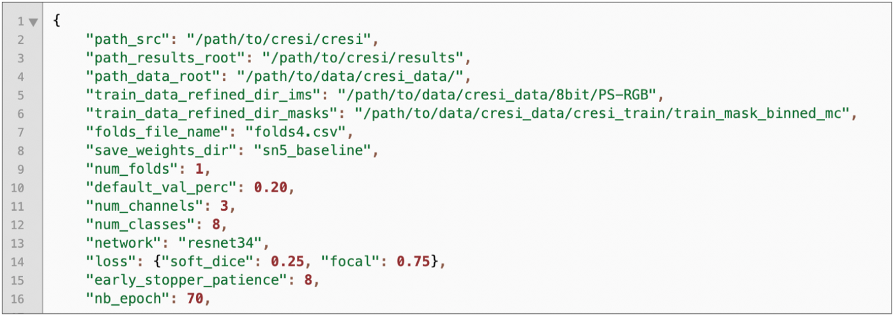

# Project Satellite: Geospatial Analysis

Determining optimal routing paths in near real-time is at the heart of many humanitarian, civil, military, and commercial challenges. This statement is as true today as it was two years ago when the SpaceNet Partners announced the SpaceNet Challenge 3 focused on road network detection and routing. In a disaster response scenario, for example, pre-existing foundational maps are often rendered useless due to debris, flooding, or other obstructions. Satellite or aerial imagery often provides the first large-scale data in such scenarios, rendering such imagery attractive.

## Project Steps:

### Data Preparation

The initial data steps were extracted from a [related medium blog on the challenge](https://medium.com/the-downlinq/the-spacenet-5-baseline-part-1-imagery-and-label-preparation-598af46d485e)

1. **City-Scale Road Extraction from Satellite Imagery (CRESI):** This repository provides an end-to-end pipeline to train models to detect routable road networks over entire cities, and also provide speed limits and travel time estimates for each roadway. We have observed success with both SpaceNet imagery and labels, as well as Google satellite imagery with OSM labels. The repository consists of pre-processing modules, deep learning segmentation model (inspired by the winning SpaceNet 3 submission by albu), post-proccessing modules to extract the road networks, inferred speed limits, and travel times. Furthermore, we include modules to scale up network detection to the city-scale, rather than just looking at small image chips. The output of CRESI is a geo-referenced NetworkX graph, with full access to the many graph-theoretic algorithms included in this package.

**Notes:**
- To use CRESI, you must install it in a docker container for the project (Preferably with a GPU enabled docker).
- [CRESI Git Repository](https://github.com/avanetten/cresi)

2. **Prepare Imagery:** In SpaceNet 5 the RGB 3-band pan-sharpened imagery utilized the Maxar DRA (Dynamic Range Adjusted) product which seeks to equalize color scales, and yields an 8-bit image.  For this project, the Multi-Spectral (MS) and the Red-Green-Blue 3-band (RGB) images exist in their initial state as well as a Pan Sharpened 8 bit image.  This was accomplished using a Maxar Dynamic Range Adjusted (DRA) product which seeks to equalize color scales and yield an 8-bit image.  Pan-Sharpening uses a higher-resolution panchromatic image or raster band to fuse with a lower-resolution, multiband raster dataset to increase the spatial resolution of the multiband image.

**Notes:** 
- While we lose a significant amount of information by utilizing only a subset of the multispectral bands, for ease of exploration we extract the 8-bit RGB imagery from the 16-bit multispectral imagery, where RGB corresponds to bands 5, 3, 2, respectively.  The images are also rescaled to the 2nd and 98th percentile of pixel values when converting to 8-bit.
- What is the advantage of obtaining 3 bands (RGB): This provides a sort of dimensionality reduction while capturing a vast majority of the imagery details required for the analysis.  16 bit can provide more information, but obviously takes 2x the data volume of 8bit and with compression this can be up to 8x compression in jpeg with no visual loss. [See Link for a full discusion](https://community.esri.com/t5/imagery-and-remote-sensing-questions/what-is-the-advantage-of-obtaining-3-bands-rgb/td-p/32286)
- **Pan Sharpening Deeper Dive:** This function is a radiometric transformation available through a raster function or from a geoprocessing tool.  Several image companies provide low-resolution, multiband images and higher-resolution, panchromatic images of the same scenes. This process is used to increase the spatial resolution and provide a better visualization of a multiband image using the high-resolution, single-band image.  There are five image fusion methods from which to create the pan sharpened image: the Brovey transformation, the Esri pan sharpening transformation; the Gram-Schmidt spectral sharpening method; the intensity, hue, saturation (IHS) transformation; and the simple mean transformation. Each of these methods uses different models to improve the spatial resolution while maintaining the color, and some are adjusted to include a weighting so that a fourth band can be included (such as the near-infrared band available in many multispectral image sources). By adding the weighting and enabling the infrared component, the visual quality in the output colors is improved. [Arcgis Pro has more information on these methods](https://pro.arcgis.com/en/pro-app/latest/help/analysis/raster-functions/fundamentals-of-pan-sharpening-pro.htm)

3. **Training Masks:** We’ll use these centerline labels and speed estimates to create training masks. We assume a mask buffer of 2 meters, meaning that each roadway is assigned a total width of 4 meters. Remember that the goal of our segmentation step is to detect road centerlines, so while this is not the precise width of the road, a buffer of 2 meters is an appropriate width for our segmentation model. 

- **Continuous Masks:** One option for training a segmentation model is to create training masks where the value of the mask is proportional to the speed of the roadway. This can be accomplished by running the speed_masks.py script.  This means that there is a single mask and the value at each point represents a fractional speed.
- **Multi-channel Masks:** A second option for training a segmentation model is to create multi-channel training masks where each channel corresponds to a speed range. In the script below we bin in 10 mph increments, for a total of 7 bins. We also append the total binary mask (as we’ll see later, this aids in initial road extraction), for a total of 8 bins.

**Notes:**
- To calculate route times and speed limits on different roads, a function has been used to differentiate between the different types of roads and apply speed-limits to each section of road [See Github for more information](https://github.com/CosmiQ/apls/blob/master/apls/road_speed.py)

#### Training new models:

The notes for this section was set up in the [blog post for the challenge](https://medium.com/the-downlinq/the-spacenet-5-baseline-part-2-training-a-road-speed-segmentation-model-2bc93de564d7)

4. **Setting Up Baseline JSON for Training:** CRESI uses a JSON file to store parameters for training and inference, we will use the sn5_baseline.json file. he first step is to replace the sample paths above with the appropriate paths to the locations of the CRESI codebase and the training dataset, e.g. For this model we use 3-band RGB imagery, and 8 unique output channels, although we should be able to modify these as we go.  This is referenced below. Finally, we define our network. The winning implementation of SpaceNet 3, submitted by competitor albu used ResNet34 as the encoder, with a U-Net like decoder, and we adopt a similar architecture (in fact, albu’s SpaceNet 3 submission forms much of the framework for the CRESI codebase). We adopt a custom loss function comprised of 25% Dice Loss and 75% Focal Loss, and train for 70 epochs.

5. **Training a Model:** We assume that the reader has built the CRESI docker container (see Part 1 for instructions), which we now open on a GPU-enabled machine. With the docker container running, we can execute python commands. First, we need to create our cross-validation folds, or in our case with just a single fold we split our data into training/validation sets and then we kick off the training process.

#### Extracting Road Speed Vectors from Satellite Imagery

The notes for this section are found in the [third and final blog post about this challenge](https://medium.com/the-downlinq/the-spacenet-5-baseline-part-3-extracting-road-speed-vectors-from-satellite-imagery-5d07cd5e1d21)

### Important Concepts

#### Road Extraction from High-Res Satellite Images:

This refers to the ability to identify roads and different road types using satillite images.  A few different methedology's have been proposed to accomplish this.  For our project we are using CRESI but there are different methedologies that we can use.

#### Geo-spatial labels:

There are multiple different formats of geospatial images and labels.  For a general overview of the different approaches, please see the [blog post covering Open Street Map and Spacenet](https://medium.com/the-downlinq/computer-vision-with-openstreetmap-and-spacenet-a-comparison-cc70353d0ace)

- **SpaceNet Labels:**
- **OSM Lables:**

### Helpful Links:
- The initial project [site and documentation](https://spacenet.ai/sn5-challenge/)
- More Geospatial challenges from the [source website](https://spacenet.ai/)
- [Github Pages](https://github.com/deepVector/geospatial-machine-learning) with code and other projects